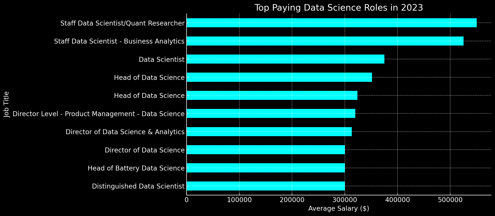
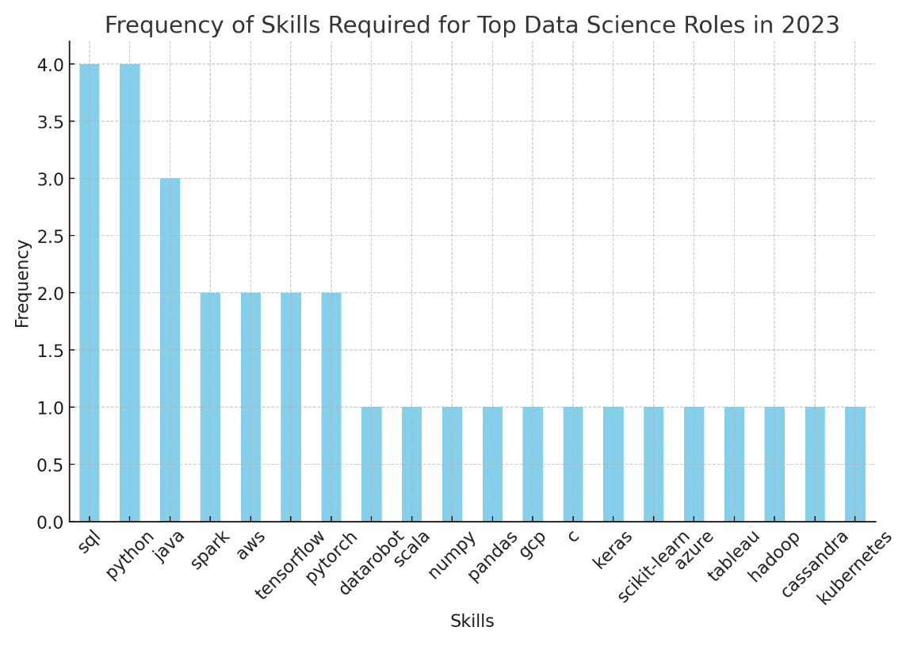

# Introduction


🔍 SQL queries? Check them out here: [project_sql folder](/project_sql/)

# Background


### The questions I wanted to answer through my SQL queries were:

1. What are the top-paying data scientist jobs?
2. What skills are required for these top-paying jobs?
3. What skills are most in demand for data scientist?
4. Which skills are associated with higher salaries?
5. What are the most optimal skills to learn?

# Tools I Used
For my deep dive into the data scientist job market, I harnessed the power of several key tools:

- **SQL:** The backbone of my analysis, allowing me to query the database and unearth critical insights.
- **PostgreSQL:** The chosen database management system, ideal for handling the job posting data.
- **Visual Studio Code:** My go-to for database management and executing SQL queries.
- **Git & GitHub:** Essential for version control and sharing my SQL scripts and analysis, ensuring collaboration and project tracking.

# The Analysis
Each query for this project aimed at investigating specific aspects of the data scientist job market. Here’s how I approached each question:

### 1. Top Paying Data Analyst Jobs
To identify the highest-paying roles, I filtered data scientist positions by average yearly salary and location, focusing on remote jobs. This query highlights the high paying opportunities in the field.

```sql
SELECT	
	job_id,
	job_title,
	job_location,
	job_schedule_type,
	salary_year_avg,
	job_posted_date,
    name AS company_name
FROM
    job_postings_fact
LEFT JOIN company_dim ON job_postings_fact.company_id = company_dim.company_id
WHERE
    job_title_short = 'Data Scientist' AND 
    job_location = 'Anywhere' AND 
    salary_year_avg IS NOT NULL
ORDER BY
    salary_year_avg DESC
LIMIT 10;
```
## Top-Paying Data Science Roles Analysis:
High Salary Range:

The salaries range from $300,000 to $550,000 annually, highlighting the lucrative nature of high-level data science positions.
The highest salary is for the "Staff Data Scientist/Quant Researcher" at Selby Jennings, demonstrating the premium on quantitative research skills in financial sectors or similarly complex analytical domains.
Job Titles and Specializations:

- **Specialized Roles**: The titles "Staff Data Scientist/Quant Researcher" and "Staff Data Scientist - Business Analytics" suggest a high value placed on specialization within data science, particularly in quantitative research and business analytics.

- **Leadership Positions**: Several of the top-paid positions are leadership roles, such as "Head of Data Science" and "Director of Data Science & Analytics". This indicates that leadership in managing teams and strategic decision-making in data science is highly valued.
Niche Roles: The "Head of Battery Data Science" at Lawrence Harvey points to niche specializations within data science that command high salaries, likely due to the specialized knowledge and skills required.

- **Company Names**:
Companies like Selby Jennings and Demandbase appear multiple times, suggesting that certain companies are willing to invest heavily in top talent to lead their data science initiatives.
The presence of various companies across different domains (from consultancy to tech and product management) illustrates the broad demand for data science expertise across industry sectors.
Remote Work Flexibility:

All listed positions are remote ("Anywhere"), reflecting the ongoing trend towards remote work in the tech industry. This flexibility allows companies to attract top talent irrespective of geographical constraints and supports a work-life balance that might contribute to these roles' desirability.


*Bar graph visualizing the salary for the top 10 salaries for data scientist; ChatGPT generated this graph from my SQL query results*

### 2. Skills for Top Paying Jobs
To understand what skills are required for the top-paying jobs, I joined the job postings with the skills data, providing insights into what employers value for high-compensation roles.
```sql
WITH top_paying_jobs AS (
    SELECT	
        job_id,
        job_title,
        salary_year_avg,
        name AS company_name
    FROM
        job_postings_fact
    LEFT JOIN company_dim ON job_postings_fact.company_id = company_dim.company_id
    WHERE
        job_title_short = 'Data Scientist' AND 
        job_location = 'Anywhere' AND 
        salary_year_avg IS NOT NULL
    ORDER BY
        salary_year_avg DESC
    LIMIT 10
)

SELECT 
    top_paying_jobs.*,
    skills
FROM top_paying_jobs
INNER JOIN skills_job_dim ON top_paying_jobs.job_id = skills_job_dim.job_id
INNER JOIN skills_dim ON skills_job_dim.skill_id = skills_dim.skill_id
ORDER BY
    salary_year_avg DESC;
```
Here's the breakdown of the most demanded skills for the top 10 highest paying data scientists jobs in 2023:
- **Popular Skills**: The most frequently listed skills in the dataset are **SQL** and **Python**. These skills are foundational for many data science roles, indicating that proficiency in data manipulation and programming is highly valued.

- **Versatility of Skills**: The presence of a variety of skills such as **SQL**, **Python**, **R**, and machine learning frameworks suggests that employers are looking for versatile data scientists who can handle different aspects of data analysis, from querying and cleaning data to applying advanced statistical and machine learning techniques.

- **Industry-Specific Skills**: Depending on the job title and the company, some specific skills such as **machine learning**, **deep learning**, and **data engineering** tools might also be emphasized. This implies that for higher-level positions, specialized knowledge in these areas could be crucial.



*Bar graph visualizing the count of skills for the top 10 paying jobs for data scientists; ChatGPT generated this graph from my SQL query results*

### 3. In-Demand Skills for Data Scientists

This query helped identify the skills most frequently requested in job postings, directing focus to areas with high demand.

```sql
SELECT 
    skills,
    COUNT(skills_job_dim.job_id) AS demand_count
FROM job_postings_fact
INNER JOIN skills_job_dim ON job_postings_fact.job_id = skills_job_dim.job_id
INNER JOIN skills_dim ON skills_job_dim.skill_id = skills_dim.skill_id
WHERE
    job_title_short = 'Data Scientist' 
    AND job_work_from_home = True 
GROUP BY
    skills
ORDER BY
    demand_count DESC
LIMIT 5;
```
Here's the breakdown of the most demanded skills for data analysts in 2023
- **Insights**:
Python Leads the Pack: **Python** is the most in-demand skill, highlighting its significance in data processing, analysis, and machine learning applications.
- **Essential Database Knowledge**: **SQL** follows closely, underscoring the need for data scientists to be proficient in database management and data retrieval.
- **Statistical Software Competence**: **R** remains crucial for statistical analysis, showcasing its importance in academia and sectors relying heavily on statistics.
- **Cloud and Visualization Skills**: **AWS** and **Tableau** appear as essential skills, emphasizing the growing need for cloud computing expertise and data visualization capabilities in the field of data science.

| Skills   | Demand Count |
|----------|--------------|
| Python      | 10390         |
| SQL    | 7488         |
| R   | 4674         |
| AWS  | 2593         |
| Tableau | 2458         |


*Table of the demand for the top 5 skills in data scientist job postings*

### 4. Skills Based on Salary
Exploring the average salaries associated with different skills revealed which skills are the highest paying.
```sql
SELECT 
    skills,
    ROUND(AVG(salary_year_avg), 0) AS avg_salary
FROM job_postings_fact
INNER JOIN skills_job_dim ON job_postings_fact.job_id = skills_job_dim.job_id
INNER JOIN skills_dim ON skills_job_dim.skill_id = skills_dim.skill_id
WHERE
    job_title_short = 'Data Scientist'
    AND salary_year_avg IS NOT NULL
    AND job_work_from_home = True 
GROUP BY
    skills
ORDER BY
    avg_salary DESC
LIMIT 25;
```
High-Value Technical Skills:

9 **GDPR**: The top skill by salary is knowledge related to the General Data Protection Regulation (GDPR), indicating that expertise in data privacy laws can be highly lucrative.
Golang: Skills in Go programming language are also highly valued, likely due to its efficiency and suitability for scalable systems, which are critical in data processing.

- **Diverse Technology Stack**: Atlassian, Selenium, and OpenCV: This range suggests a demand for skills in project management tools, test automation, and computer vision, respectively.
Database and Big Data Technologies: Skills like Neo4j (a graph database), DynamoDB (a NoSQL database), and Cassandra reflect a high salary potential for professionals skilled in diverse data storage technologies.
Specialized Skills in Emerging Technologies:

- **MicroStrategy and Qlik**: Expertise in these business intelligence tools demonstrates the value of being able to leverage data for strategic decision-making.
Solidity and Rust: High salaries associated with these programming languages highlight the growing importance of blockchain and systems programming skills in the data science field.
Analytical Tools and Frameworks:

- **DataRobot and Looker**: Knowledge in automated machine learning platforms and business intelligence visualization tools shows that there is a premium on skills that enhance data-driven insights and reporting capabilities.
Programming Diversity:

Beyond the common **Python** and **R**, programming languages like **PHP**, **Go**, and **Julia** being on the list suggest that diverse programming knowledge can also lead to high salaries, especially when these skills are applied in specialized or niche areas.


| Skills         | Average Salary ($) |
|----------------|-------------------:|
| gdpr           |            217,738 |
| golang         |            208,750 |
| atlassian      |            189,700 |
| selenium       |            180,000 |
| opencv         |            172,500 |
| neo4j          |            171,655 |
| microstrategy  |            171,147 |
| dynamodb       |            169,670 |
| php            |            168,125 |
| tidyverse      |            165,513 |
| solidity       |            165,000 |
| c              |            164,865 |
| go             |            164,691 |
| datarobot      |            164,500 |
| qlik           |            164,485 |
| redis          |            162,500 |
| watson         |            161,710 |
| rust           |            161,250 |
| elixir         |            161,250 |
| cassandra      |            160,850 |
| looker         |            158,715 |
| slack          |            158,333 |
| terminal       |            157,500 |
| airflow        |            157,414 |
| julia          |            157,244 |


*Table of the average salary for the top 10 paying skills for data scientists*

### 5. Most Optimal Skills to Learn

Combining insights from demand and salary data, this query aimed to pinpoint skills that are both in high demand and have high salaries, offering a strategic focus for skill development.

```sql
WITH skills_demand AS (
    SELECT
        skills_dim.skill_id,
        skills_dim.skills,
        COUNT(skills_job_dim.job_id) AS demand_count
    FROM job_postings_fact
    INNER JOIN skills_job_dim ON job_postings_fact.job_id = skills_job_dim.job_id
    INNER JOIN skills_dim ON skills_job_dim.skill_id = skills_dim.skill_id
    WHERE
        job_title_short = 'Data Scientist' 
        AND salary_year_avg IS NOT NULL
        AND job_work_from_home = True 
    GROUP BY
        skills_dim.skill_id
), 
-- Skills with high average salaries for Scientist roles
-- Use Query #4
average_salary AS (
    SELECT 
        skills_job_dim.skill_id,
        ROUND(AVG(job_postings_fact.salary_year_avg), 0) AS avg_salary
    FROM job_postings_fact
    INNER JOIN skills_job_dim ON job_postings_fact.job_id = skills_job_dim.job_id
    INNER JOIN skills_dim ON skills_job_dim.skill_id = skills_dim.skill_id
    WHERE
        job_title_short = 'Data Scientist'
        AND salary_year_avg IS NOT NULL
        AND job_work_from_home = True 
    GROUP BY
        skills_job_dim.skill_id
)
SELECT 
    skills_dim.skill_id,
    skills_dim.skills,
    COUNT(skills_job_dim.job_id) AS demand_count,
    ROUND(AVG(job_postings_fact.salary_year_avg), 0) AS avg_salary
FROM job_postings_fact
INNER JOIN skills_job_dim ON job_postings_fact.job_id = skills_job_dim.job_id
INNER JOIN skills_dim ON skills_job_dim.skill_id = skills_dim.skill_id
WHERE
    job_title_short = 'Data Scientist'
    AND salary_year_avg IS NOT NULL
    AND job_work_from_home = True 
GROUP BY
    skills_dim.skill_id
HAVING
    COUNT(skills_job_dim.job_id) > 10
ORDER BY
    avg_salary DESC,
    demand_count DESC
LIMIT 25;
```

| Skills     | Demand Count | Average Salary ($) |
|------------|--------------|-------------------:|
| python     |          763 |            143,828 |
| aws        |          217 |            149,630 |
| tableau    |          219 |            146,970 |
| tensorflow |          126 |            151,536 |
| pytorch    |          115 |            152,603 |
| pandas     |          113 |            144,816 |
| spark      |          149 |            150,188 |
| snowflake  |           72 |            152,687 |
| numpy      |           73 |            149,089 |
| scikit-learn |         81 |            148,964 |
*Table of the most optimal skills for data scientists sorted by salary*

### Key Insights:
#### High Demand for Python:
- **Python** stands out with the highest demand (763 mentions), confirming its status as a cornerstone in the data science toolkit due to its versatility and the extensive support from libraries for data analysis and machine learning.

#### Cloud and Big Data Technologies:
- **AWS** and **Tableau** show strong demand (217 and 219 mentions, respectively), highlighting the importance of cloud solutions and data visualization skills in today's data-driven industries.
- **Snowflake**, a cloud data platform, also appears in the top 10, emphasizing the growing reliance on cloud-native technologies for data storage and analysis.

#### Machine Learning Frameworks:
- **TensorFlow** and **PyTorch** are the most demanded frameworks (126 and 115 mentions, respectively), which suggests a robust interest in deep learning technologies across various sectors.
- These tools are crucial for developing complex models that can handle tasks from natural language processing to image recognition.

#### Data Processing and Analysis Tools:
- **Spark** is highly demanded (149 mentions) due to its ability to handle large-scale data processing, which is essential for big data analytics.
- **Pandas**, a data manipulation library in Python, also shows significant demand (113 mentions), underscoring its role in data cleaning and analysis.

#### Statistical and Machine Learning Libraries:
- **Numpy** and **Scikit-learn** feature prominently (73 and 81 mentions, respectively), indicating their importance in numerical computing and traditional machine learning tasks.


# What I Learned

# What I Learned

Throughout this journey, I've significantly enhanced my proficiency with SQL, equipping myself with advanced techniques and skills:

- **Complex Query Crafting:** I have developed expertise in crafting sophisticated SQL queries, proficiently merging tables and employing WITH clauses to manage temporary tables effectively.
- **Data Aggregation:** I've become adept at utilizing GROUP BY clauses and have mastered the application of aggregate functions such as COUNT() and AVG() to distill complex data into clear summaries.
- **Analytical Wizardry:** I have honed my ability to translate real-world questions into actionable, insightful SQL queries, elevating my problem-solving skills to address practical challenges effectively.


# Conclusions

### Insights
From the analysis, several general insights emerged:


### Closing Thoughts

